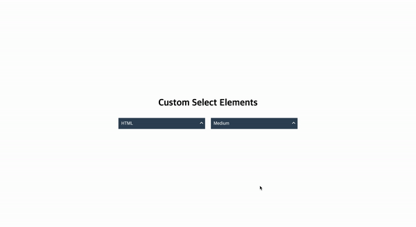

# 프로젝트 제목
커스텀 셀렉트

# 프로젝트 내용
css만으로 부족한 셀렉트박스 스타일을 라이브러리를 사용하지 않고 만든 커스텀 셀렉트박스

## 사용 설명
* 기능을 적용할 select에 j-select 클래스 추가
* option value와 text는 기존에 하시던 값을 추가
* script가 실행 되면서 select를 감싸는 ui-wrap 생성
* ui-wrap 안에 option 선택시 값이 보이는 ui-select 생성
* option 값을 감싸는 ui-option-box 생성
* ui-option-box 안에 ui-option 생성
* ui-option 선택시 select안에 option 값이 selected

## 프로젝트 화면

# 프로그램 주요 스택

## 클라이언트

* HTML
* Css
* Javascript
